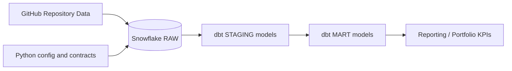

# Market Intelligence Platform - Project Documentation

## 1. Executive Summary

This project demonstrates a professional market analytics data architecture:

- Version control and collaboration in GitHub.
- Data storage and modeling in Snowflake.
- SQL transformations with dbt.
- Automated code quality with tests and linting.

Airflow is managed in another repository by design, separating orchestration from transformation logic and application concerns.

## 2. Technical Objective

Build a reusable foundation to:

- ingest repository metadata (or other market sources) into the RAW layer,
- standardize and clean data in STAGING,
- publish business KPIs in MART,
- demonstrate senior-level practices for traceability, versioning, and quality.

## 3. Architecture



Snowflake layers:

- RAW: untransformed ingestion data.
- STAGING: normalization and cleanup.
- MART: business-facing analytical tables.
- CORE: operational audit data.

## 4. Repository Structure

- `src/market_intelligence_platform/`: configuration and integrations.
- `tests/`: package smoke tests.
- `sql/snowflake/bootstrap_storage.sql`: bootstrap for database, schemas, stage, and base tables.
- `dbt/`: dbt project for transformations.
- `.github/workflows/ci.yml`: CI quality pipeline.

## 5. Environment Configuration

Required variables:

- GitHub: `GITHUB_OWNER`, `GITHUB_REPOSITORY`, `GITHUB_BRANCH`
- Snowflake: `SNOWFLAKE_ACCOUNT`, `SNOWFLAKE_USER`, `SNOWFLAKE_PASSWORD`, `SNOWFLAKE_ROLE`, `SNOWFLAKE_WAREHOUSE`, `SNOWFLAKE_DATABASE`, `SNOWFLAKE_SCHEMA`
- dbt: `DBT_TARGET`

Template file: `.env.example`.

## 6. Python Component

Key file: `src/market_intelligence_platform/integrations.py`

What it provides:

- `GitHubRepositoryConfig`: repository configuration contract.
- `SnowflakeConfig`: connection contract and readiness logic.
- `ProjectIntegrations`: consolidated integration state.

This allows system readiness validation before running ingestion or transformation processes.

## 7. dbt Component

Project located in `dbt/` with profile `market_intelligence_snowflake`.

Included models:

- `sources.yml`: defines RAW source `GITHUB_REPOSITORY_SNAPSHOT`.
- `stg_github_repository_snapshot.sql`: typing and basic cleanup.
- `mart_repository_kpi.sql`: score and daily change calculation.

Configuration:

- Default materialization set to `view`.
- MART models materialized as `table`.
- Data quality tests for key fields (`not_null`, `unique`).

## 8. CI and Quality

Current pipeline:

- `ruff check .`
- `pytest`

Current tests:

- package version,
- local configuration loading,
- integration readiness state,
- GitHub/Snowflake contract validations.

## 9. Local Execution

```bash
pip install -r requirements.txt
pytest
ruff check .
dbt debug --project-dir dbt --profiles-dir dbt
dbt run --project-dir dbt --profiles-dir dbt
dbt test --project-dir dbt --profiles-dir dbt
```

## 10. Recommended Roadmap

1. Build a GitHub API extractor into RAW.
2. Add dbt snapshots for change history.
3. Publish a data contract and advanced data quality checks.
4. Integrate dbt deployment with GitHub Actions and dev/prod environments.
5. Connect a BI tool to present portfolio KPIs.

## 11. Security

- Do not commit secrets or passwords.
- Use GitHub Secrets for CI/CD.
- Rotate shared credentials used during testing.
- Avoid using `ACCOUNTADMIN` for daily execution; create a dedicated role.
