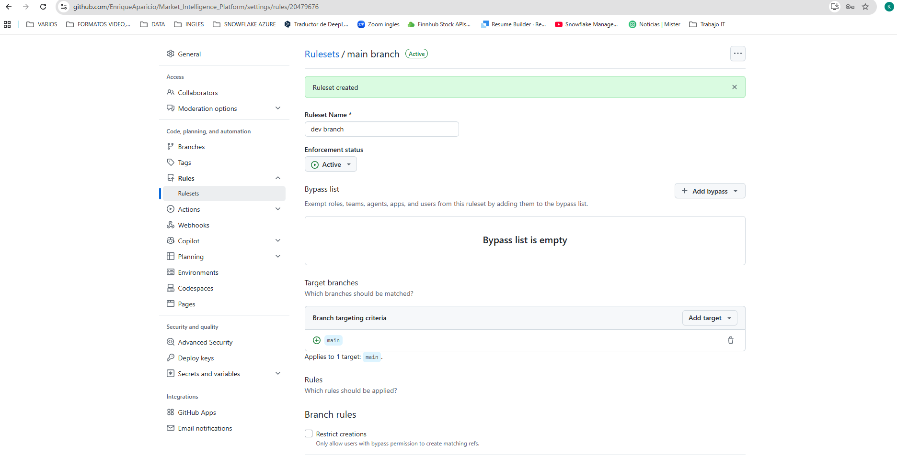
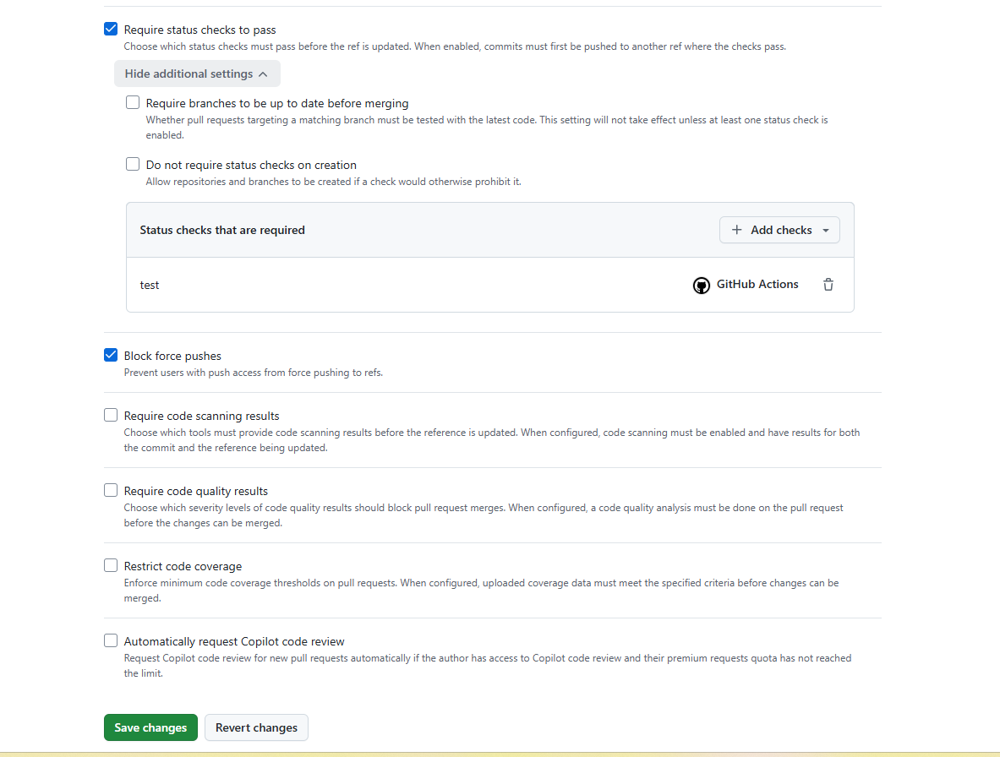
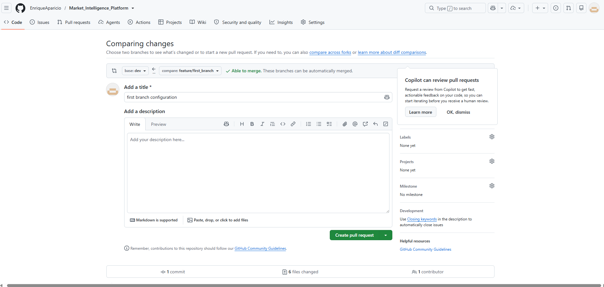

# GitHub Branch Rulesets Guide

This guide shows how I structure, protect, and operate the repository branches for a portfolio project.

## 1. Project Purpose

The goal is to keep the repository professional, easy to review, and simple to understand during a portfolio walkthrough.

I use three branch layers:

1. `feature/*` for isolated work.
2. `dev` for integration and validation.
3. `main` for reviewed and approved code.

## 2. Branch Strategy

The branch flow is:

1. Create a feature branch from `dev`.
2. Build and test changes on the feature branch.
3. Open a pull request from the feature branch into `dev`.
4. Review the PR and wait for checks to pass.
5. Merge the feature branch into `dev`.
6. When `dev` is stable, open a pull request from `dev` into `main`.
7. Merge `dev` into `main` only after approvals and checks.

Important rule:

- Do not push directly to `main`.
- `main` must remain protected so every change goes through a pull request.

## 3. Repository Setup Before Rulesets

Before creating GitHub rulesets, confirm that these branches exist in GitHub:

- `main`
- `dev`

If they do not exist yet, create and push them locally first.

## 4. Create the `dev` Ruleset

I would configure `dev` as the active development branch.

### 4.1 Open the Ruleset Page

1. Open the repository in GitHub.
2. Go to `Settings`.
3. Open `Rules` and then `Rulesets`.
4. Click `New branch ruleset`.

### 4.2 Basic Settings

1. Set `Ruleset Name` to `dev protection`.
2. Keep `Enforcement status` as `Active`.
3. Leave `Bypass list` empty unless you have a specific reason to allow exemptions.

### 4.3 Target Branch

1. In `Target branches`, click `Add target`.
2. Choose `Include by pattern`.
3. Type `dev`.
4. Save the target.

### 4.4 Rules for `dev`

Enable these rules for the `dev` branch:

- Require a pull request before merging
- Block force pushes
- Restrict deletions

Recommended quality rule:

- Require status checks to pass

If GitHub shows the message that required checks cannot be empty, temporarily disable the rule, save the ruleset, run one PR to generate checks, and then edit the ruleset again to add the check.



Caption: GitHub warning shown when status checks are required but none have been selected yet.

### 4.5 Pull Request Settings for `dev`

Inside the pull request rule, I recommend:

- Minimum approvals: `1`
- Require conversation resolution before merging: `On`
- Dismiss stale pull request approvals when new commits are pushed: `Optional`

## 5. Create the `main` Ruleset

I would configure `main` as the protected release branch.

### 5.1 Target Branch

1. Create another branch ruleset.
2. Set `Ruleset Name` to `main protection`.
3. Set the target branch pattern to `main`.



Caption: Example of the `main` branch being selected as the protected target.

### 5.2 Rules for `main`

Enable these rules for `main`:

- Require a pull request before merging
- Require status checks to pass
- Require conversation resolution before merging
- Block force pushes
- Restrict deletions

Recommended approvals for `main`:

- Minimum approvals: `1` or `2`

## 6. Set the Default Branch

1. Go to `Settings`.
2. Open `Branches`.
3. Set the default branch to `main`.

## 7. Local Command Workflow

This is the workflow I would follow in the terminal when building the project.

```powershell
# Start from dev and create a feature branch
git checkout dev
git pull origin dev
git checkout -b feature/first_branch

# Run dbt checks before committing
$env:SNOWFLAKE_ACCOUNT='<account>'
$env:SNOWFLAKE_USER='<user>'
$env:SNOWFLAKE_PASSWORD='<password>'
$env:SNOWFLAKE_ROLE='ACCOUNTADMIN'
$env:SNOWFLAKE_WAREHOUSE='COMPUTE_WH'
$env:SNOWFLAKE_DATABASE='MARKET_INTELLIGENCE_DB'
$env:SNOWFLAKE_SCHEMA='CORE'
$env:DBT_TARGET='dev'
dbt debug --project-dir dbt --profiles-dir dbt
dbt run --project-dir dbt --profiles-dir dbt

# Commit and push the feature branch
git add .
git commit -m "first branch configuration"
git push origin feature/first_branch

# Open a pull request from feature/first_branch into dev
# After dev is stable, merge dev into main through a pull request
```



Caption: Example of a feature branch being pushed after the workflow is set up and validated.

Important notes:

- Replace placeholder values with your real environment values.
- Do not commit passwords or tokens into the repository.
- Keep `main` protected and use pull requests for every merge.

## 8. Git and GitHub Command Reference

This section collects the commands I use most often when managing branches, syncing with GitHub, and preparing pull requests.

### 8.1 Check the Repository State

```powershell
git status
git branch
git branch -a
git remote -v
```

Use these commands to see:

- which branch you are on,
- what files changed,
- which branches exist locally and remotely,
- which GitHub remote is configured.

### 8.2 Create and Switch Branches

```powershell
git checkout dev
git pull origin dev
git checkout -b feature/first_branch
```

Use this flow when starting new work from `dev`.

### 8.3 Save and Push Changes

```powershell
git add .
git commit -m "feature: describe the change"
git push origin feature/first_branch
```

Use this flow after finishing a feature branch change.

### 8.4 Pull the Latest Changes

```powershell
git checkout dev
git pull origin dev
```

```powershell
git checkout main
git pull origin main
```

Use `git pull` before starting new work so your branch is updated.

### 8.5 Merge Workflow Between Branches

Recommended branch flow:

1. `feature/*` into `dev`
2. `dev` into `main`

Important:

- Merge through pull requests in GitHub.
- Avoid direct pushes to `main`.
- Keep `dev` as the integration branch.

### 8.6 Pull Request Workflow

1. Push your feature branch to GitHub.
2. Open a pull request from `feature/first_branch` into `dev`.
3. Wait for CI checks to pass.
4. Merge the pull request.
5. When `dev` is stable, open a pull request from `dev` into `main`.

### 8.7 Reconnect the Remote If Needed

```powershell
git remote -v
git remote set-url origin https://github.com/EnriqueAparicio/Market_Intelligence_Platform.git
```

Use this if the remote URL is wrong or you need to verify the GitHub connection.

### 8.8 Useful Commands for Daily Work

```powershell
git log --oneline --graph --decorate --all
git diff
git diff --staged
git stash
git stash pop
```

These commands help you review history, inspect changes, and temporarily store unfinished work.

## 9. Suggested Branch Names

- `feature/github-ingestion`
- `feature/new-kpi-model`
- `fix/dbt-schema-bug`
- `chore/readme-update`

## 10. Common Errors and Fixes

### Error: Repository Not Found

- Verify the remote URL owner and repository name.
- Verify the repository exists in GitHub web.
- Verify authentication is valid.

### Error: Required Status Checks Cannot Be Empty

- Save without required checks.
- Run one pull request with Actions.
- Edit the ruleset and add actual check names.

### Error: No Checks Available in the List

- Trigger GitHub Actions by pushing a commit or opening a PR.
- Return to the ruleset and select the check.

## 11. Quick Verification Checklist

- `main` and `dev` exist in GitHub
- `main` is the default branch
- `main` ruleset exists and is active
- `dev` ruleset exists and is active
- Force push is blocked on `main` and `dev`
- Pull requests are required on `main` and `dev`
- Status checks are required where configured

